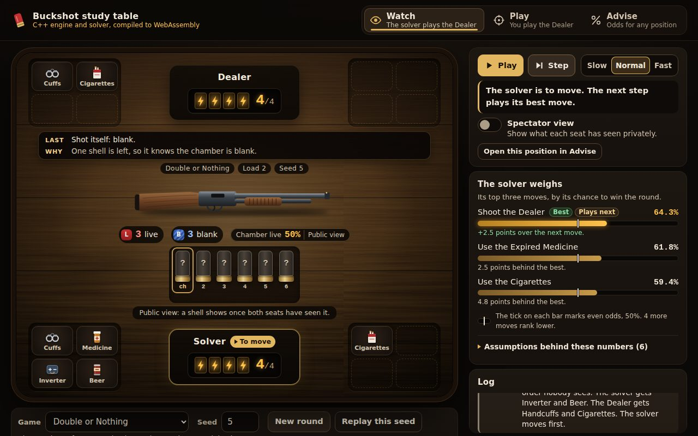

<a id="readme-top"></a>

<div align="center">

# Buckshot Roulette Solver

### An expectiminimax move advisor and a playable opponent

[](https://github.com/CameronScarpati/buckshot-roulette-bot/actions/workflows/build.yml)

Describe any position from [Buckshot Roulette](https://store.steampowered.com/app/2835570/Buckshot_Roulette/)
and this ranks the moves worth considering by the probability that you are the last player
standing, under a stated opponent model, along with the assumptions that produced the number.
It also plays.

**[Open it in the browser](https://cameronscarpati.github.io/buckshot-roulette-bot/)**

</div>

## What it does

- **Advises.** Give it a position, by one line of notation or by narrating the round as it
  happens, and it ranks every move the game allows with a win probability, marks ties, and
  names the opponent model it used.
- **Plays.** Take a seat against the solver or against the game's scripted dealer, or watch
  the solver play the dealer with every move explained. The shells and the dealer's coins come
  from a seed, so a whole round replays exactly.
- **Models the dealer, as an option.** The single-player dealer's script, read rule by rule
  from a decompilation of the game, can stand in for the opponent in the advisor and in play.
  The default opponent model is unchanged: it plays to minimise your chance.
- **Covers the game.** Two to four seats, all eleven items, and the single-player and
  multiplayer rule sets as settings on one engine.

The numbers are probabilities, not scores. A move worth 0.60 wins the round three times in
five against the model described in [docs/RULES.md](docs/RULES.md), and that document marks
every rule as verified against the game or its decompiled script, sourced to a citable page, or
assumed by this engine because nothing settles it.

## In the browser



The engine and the solver also run on
[a web page](https://cameronscarpati.github.io/buckshot-roulette-bot/), compiled to
WebAssembly. It has three modes.

- **Watch.** The solver plays the scripted dealer and shows its top three moves, with their
  chances, before each of its turns.
- **Play.** You play the scripted dealer, and the solver ranks your moves when you ask for a
  hint.
- **Advise.** Write down a position, or paste a line of notation, and the solver ranks the
  moves in it against the scripted dealer or against an opponent that plays to minimise your
  chance.

The page runs entirely in the browser. It is static files and the compiled engine, and it
requests nothing from any other site. [web/README.md](web/README.md) has the commands to build
the engine with Emscripten and to serve the page locally.

`.github/workflows/pages.yml` builds the page and publishes it with GitHub Pages at
<https://cameronscarpati.github.io/buckshot-roulette-bot/>.

## Quick start

```sh
git clone https://github.com/CameronScarpati/buckshot-roulette-bot.git
cd buckshot-roulette-bot
cmake -B build -DCMAKE_BUILD_TYPE=Release
cmake --build build --parallel
ctest --test-dir build --output-on-failure
```

Requires a C++17 compiler and CMake 3.16 or newer. The test suite fetches GoogleTest at
configure time, so the first build needs a network connection. These four commands are run
on a clean checkout by CI, so they cannot drift away from what works.

## Asking about a position

```sh
./build/advisor --position "p1=2/4[saw,mg] p2=4/4[beer,cuff] tube=2L3B turn=p1" --reloads 1
```

```
tube: 2 live, 3 blank
> p1  2/4 charges  items: Hand Saw, Magnifying Glass
  p2  4/4 charges  items: Beer, Handcuffs

Advising seat p1, to move: p1
  * shoot p2                          0.5893
    use Magnifying Glass              0.5068   (-0.0825)
    use Hand Saw                      0.4889   (-0.1004)
    shoot self                        0.4015   (-0.1878)
  Note: the search hit its reload budget in some lines, so those were valued by charges in hand.
  Model: double or nothing, 4 charges, 2 to 5 items dealt per load, modelled at 4, after a reload seat 1 acts first, a sawed barrel survives a reload, a reload clears handcuffs. The other seat plays to minimise your chance of surviving the round, spending no magnifying glasses or burner phones, so it is modelled slightly weaker than a player who tracks shells. The answer is given from what the advised seat has seen: a shell only somebody else has looked at is unknown to you and known to them, and the value averages over how it could have fallen. Approximations: the search looks through 1 reload and scores a round still going past that by each seat's share of the charges left; a reload deals each seat one fixed set of items, taken from the pool in order, rather than a random draw; every reload deals the same number of items, the one named above; a choice does not infer a shell's type from what another seat chose to do; at most 4 shells that only another seat has looked at are averaged over, and past that they are treated as seen by nobody; and a seat that has not seen a shell picks evenly between moves it cannot tell apart, ranking them as though no other seat had seen that shell either. Where the game's scene data has not been extracted, such as the story loads and the item pool, the rules follow the assumptions listed in docs/RULES.md. Values are the probability of being the last player standing in this round.
  1544973 states examined.
```

### The notation

```
p1=3/4[saw,beer] p2=2/4[mg] tube=2L3B turn=p1 cuffed=p2 sawed inverted known=p1:0L,2B dir=ccw
```

| Token | Meaning |
|---|---|
| `p1=3/4[saw,beer]` | seat 1 has 3 charges of 4 and holds those items, in the order they sit in its hand |
| `tube=2L3B` | two live and three blank shells remain |
| `turn=p1` | seat 1 is to move |
| `cuffed=p2` | seat 2 is handcuffed and will be skipped |
| `skipped=p2` | seat 2 already lost a turn to handcuffs and is owed one back |
| `restraintused` | the seat to move has already spent a restraint this turn |
| `sawed` | the barrel is sawed for the next shot |
| `inverted` | an inverter flipped a chamber nobody has seen |
| `known=p1:0L,2B` | seat 1 has seen the chamber (live) and shell 3 (blank) |
| `dir=ccw` | turn order runs the other way after a remote |

Item tokens: `mg`, `beer`, `cig`, `cuff`, `saw`, `phone`, `adr`, `inv`, `med`, `jam`, `rem`.

### Changing a rule

Some of this game's numbers sit in its scene files rather than its scripts, and those have not
been extracted, so for them the engine had to pick a value and say so: the story stages' loads
and the item pool are the main ones, and [docs/RULES.md](docs/RULES.md) lists each. The rules
the scripts do settle are still worth being able to change, because seeing what a rule is worth
is the point. Eight rules are options on both binaries, which means a rule can be settled by
playing a round and then checking the answer rather than by argument.

```sh
./build/advisor --position "p1=4/4[mg] p2=4/4 tube=2L3B turn=p1"
./build/advisor --position "p1=4/4[mg] p2=4/4 tube=2L3B turn=p1" --reload-turn keep
```

| Who acts first after a mid-round reload | Best move | Its value |
|---|---|---|
| Seat 1, the default | shoot p2 | 0.8258 |
| Whoever was to move | shoot p2 | 0.5382 |

Each of these looks through the default two reloads and took about two minutes and a little
over 2 GB of memory on one machine.

This is also the setting the results table further down calls the chair. The default is the
rule the game uses, and playing the same hundred rounds under the other value takes seat 1
from 74 of 100 to 52 of 100, which is the clearest measure of how much rests on it.

```sh
./build/play --selfplay 100 --seed 1 --charges 2 --reloads 0
./build/play --selfplay 100 --seed 1 --charges 2 --reloads 0 --reload-turn keep
```

`--help` on either binary lists every setting, and
[docs/RULES.md](docs/RULES.md) maps each one to the field it changes.

### Narrating a round

Run `./build/advisor` with no arguments and describe what happens as it happens. The advisor
tracks what each seat has seen, which is what makes an answer different from a table of odds.
This session looks through one reload rather than the default two. At two, both answers for
this position stop at the search's node limit and say that their values may be wrong, and the
session took about eight minutes and 4.5 GB of memory on one machine; at one it took about
twenty seconds.

```
reloads 1
set p1=4/4[mg,saw] p2=4/4[beer,cuff] tube=2L2B turn=p1
advise
mg blank
advise
```

```
Advising seat p1, to move: p1
  * shoot p2                          0.7032
    use Magnifying Glass              0.6934   (-0.0098)
    use Hand Saw                      0.6592   (-0.0439)
    shoot self                        0.6465   (-0.0566)

tube: 2 live, 2 blank
> p1  4/4 charges  items: Hand Saw  knows: shell 1 is blank
  p2  4/4 charges  items: Beer, Handcuffs

Advising seat p1, to move: p1
  * shoot self                        0.6328
    shoot p2                          0.5428   (-0.0900)
    use Hand Saw                      0.5178   (-0.1150)
```

Knowing the chamber is blank turns shooting yourself from the worst move into the best one,
because a blank fired at yourself costs nothing and keeps the turn. `help` lists every
command: shots, ejections, reveals, item use, edits to charges and inventories, and `undo`.

### Against the scripted dealer

By default p2 plays to minimise your chance (`--opponent solver`). `--opponent dealer`
replaces it with the single-player dealer as the game scripts it: it uses items, picks a
target and flips its coin by the rules in
[docs/RULES.md](docs/RULES.md#the-scripted-dealer), so the value is your chance against that
dealer rather than against a minimising opponent. It needs two seats and p1 advised, and
`--mode` chooses between Double or Nothing (`don`, the default) and the story stages
(`story1`, `story2`, `story3`), which run the dealer's simpler story rules.

```sh
./build/advisor --position "p1=2/4[saw,mg] p2=4/4[beer,cuff] tube=2L3B turn=p1" --reloads 1 --opponent dealer
```

```
tube: 2 live, 3 blank
> p1  2/4 charges  items: Hand Saw, Magnifying Glass
  p2  4/4 charges  items: Beer, Handcuffs

Advising seat p1, to move: p1
  * shoot p2                          0.6458
    use Magnifying Glass              0.5887   (-0.0571)
    use Hand Saw                      0.5485   (-0.0973)
    shoot self                        0.4795   (-0.1663)
  Note: the search hit its reload budget in some lines, so those were valued by charges in hand.
  Model: double or nothing, 4 charges, [...] The other seat is the dealer, and it plays the game's own dealer script with its endless rules: [...]
  225831 states examined.
```

This is the position at the top of Asking about a position, and the values differ from the
ones there because the opponent model differs. When the dealer is to move there is nothing to
rank, since it does not choose between moves, so the advisor prints your chance from that
position instead:

```sh
./build/advisor --position "p1=3/4[saw] p2=3/4[mg,beer] tube=2L2B turn=p2" --reloads 1 --opponent dealer
```

```
tube: 2 live, 2 blank
  p1  3/4 charges  items: Hand Saw
> p2  3/4 charges  items: Magnifying Glass, Beer

Advising seat p1. The dealer (p2) is to move and plays by its script.
  Your chance of being the last player standing: 0.8346
  [...]
```

While narrating a round, `opponent dealer` and `opponent solver` switch between the two.

## Playing

```sh
./build/play --seed 7 --charges 4
```

You take seat 1 and choose from a numbered menu. The solver answers from the same engine that
produced the advice above, and with each of its moves it says what it rates its own chances at,
unless that number could tell you something only it has seen: it keeps the number back for the
rest of a load once it has heard a shell on a Burner Phone, and while it knows a shell its
Magnifying Glass showed it that you have not seen. The board you see shows the shells you have
seen and none that the solver has looked at.

This command keeps the default budget of two reloads, and at four charges a search that deep
is large. On one machine the solver's first move in this round took about four minutes and
4.5 GB of memory, and its search stopped at the node limit, which the move says. With
`--reloads 1` the same move took about eight seconds and 0.3 GB.

### Against the dealer

```sh
./build/play --opponent dealer --seed 6 --charges 2 --reloads 0
```

Seat 2 is now the scripted dealer. Each of its moves is drawn from its rules with the seeded
generator, and you are told what it does but not what it learns: the board you see leaves out
the shells it has looked at, as the game does. A turn you lose to its handcuffs is reported
when it is lost.

```
tube: 2 live, 2 blank
> p1  2/2 charges  items: Handcuffs, Burner Phone, Cigarettes
  p2  2/2 charges  items: Adrenaline, Expired Medicine, Cigarettes

Your move:
  1) shoot self
  2) shoot p2
  3) use Cigarettes
  4) use Handcuffs on p2
  5) use Burner Phone
> 2
p1 shoots the dealer.
  The shell was LIVE.

tube: 1 live, 2 blank
  p1  2/2 charges  items: Handcuffs, Burner Phone, Cigarettes
> p2  1/2 charges  items: Adrenaline, Expired Medicine, Cigarettes
The dealer uses its Cigarettes.
  The dealer is now on 2/2 charges.
The dealer uses Adrenaline to take p1's Handcuffs, and uses it.
  p1 is handcuffed and will lose the next turn.
The dealer shoots itself.
  The shell was LIVE.
p1 is handcuffed and loses this turn.
```

`--mode story1`, `story2` or `story3` plays a story stage instead, with that stage's charges.
`story3` is shown as five charges, four normal ones and a last, faded one. A hit on a seat with
a normal charge left never takes it past the faded one, even from a sawed barrel, and a seat on
the faded charge cannot heal and is out at its next hit. The game takes a story stage's loads
from fixed data for each round, which is not in the decompiled scripts, so here a story stage
draws its loads at random from the solver's distribution instead.

### Watching the solver play the dealer

```sh
./build/play --watch --seed 6 --charges 2 --reloads 0
```

The solver takes seat 1. Before each of its moves it prints the board and up to three of the
moves it ranks highest, with their values. A star marks each move worth the most, and when
several tie, a line says so and that p1 plays the first one listed. A move that only spends an
item, such as Cigarettes at full charges, says so and is listed after any move it ties with,
since the item may still be worth keeping past the search. What p1's own glass or
phone shows is printed after its move. When some of the values stop at the reload budget, the
weighing calls its chance estimated, and the first such weighing in a round adds a note that
says what that means. A weighing whose search stopped at the node limit says so as well. Every
dealer move comes with the rule that produced it. A spectator is shown what the dealer learned
privately, and each such line says so. What the dealer works out about the chamber as its pass
begins, such as the type of the last shell, starts a line of its own before the item it then
uses. Shells are numbered from the chamber, which is shell 1, so a shell's number drops as the
shells ahead of it leave. `--pace 800` waits 800 milliseconds before each move, so a round can
be followed as it plays.

```
tube: 2 live, 2 blank
> p1  2/2 charges  items: Handcuffs, Burner Phone, Cigarettes
  p2  2/2 charges  items: Adrenaline, Expired Medicine, Cigarettes
p1 (solver) weighs, by its estimated chance of surviving the round:
  * use Handcuffs on p2                         0.7153
    use Burner Phone                            0.7130
    use Cigarettes                              0.6667   (only spends the item)
  Note: some lines hit the reload budget and were valued by each seat's share of
        the charges in hand. Every weighing marked estimated holds values like
        these.
p1 uses its Handcuffs.
  The dealer is handcuffed and will lose the next turn.

tube: 2 live, 2 blank
> p1  2/2 charges  items: Burner Phone, Cigarettes
  p2  2/2 charges  cuffed  items: Adrenaline, Expired Medicine, Cigarettes
p1 (solver) weighs, by its estimated chance of surviving the round:
  * shoot p2                                    0.7153
    use Burner Phone                            0.7130
    shoot self                                  0.6944
p1 shoots the dealer.
  The shell was blank.
The dealer is handcuffed and loses this turn.

tube: 2 live, 1 blank
> p1  2/2 charges  items: Burner Phone, Cigarettes
  p2  2/2 charges  lost a turn  items: Adrenaline, Expired Medicine, Cigarettes
p1 (solver) weighs, by its estimated chance of surviving the round:
  * shoot p2                                    0.5833
  * use Burner Phone                            0.5833
    use Cigarettes                              0.5000   (only spends the item)
  2 moves tie at the top, and p1 plays the first one listed.
p1 shoots the dealer.
  The shell was LIVE.

tube: 1 live, 1 blank
  p1  2/2 charges  items: Burner Phone, Cigarettes
> p2  1/2 charges  items: Adrenaline, Expired Medicine, Cigarettes
The dealer uses its Cigarettes.
  The dealer is now on 2/2 charges.
  Why: It is below its full charges.
The dealer shoots p1.
  The shell was LIVE.
  Why: With no target and as many live as blank shells, a fair coin chose to
       shoot p1.

tube: 0 live, 1 blank
> p1  1/2 charges  items: Burner Phone, Cigarettes
  p2  2/2 charges  items: Adrenaline, Expired Medicine
p1 (solver) weighs, by its estimated chance of surviving the round:
  * use Cigarettes                              0.5000
    use Burner Phone                            0.5000   (only spends the item)
    shoot self                                  0.3333
p1 uses its Cigarettes.
  p1 is now on 2/2 charges.

tube: 0 live, 1 blank
> p1  2/2 charges  items: Burner Phone
  p2  2/2 charges  items: Adrenaline, Expired Medicine
p1 (solver) weighs, by its estimated chance of surviving the round:
  * shoot self                                  0.5000
  * shoot p2                                    0.5000
    use Burner Phone                            0.5000   (only spends the item)
  2 moves tie at the top, and p1 plays the first one listed.
p1 shoots itself.
  The shell was blank.

The gun is loaded with 2 live and 2 blank.
New items are dealt, and p1 moves first.

tube: 2 live, 2 blank
> p1  2/2 charges  items: Burner Phone, Cigarettes, Beer, Hand Saw, Adrenaline, Handcuffs
  p2  2/2 charges  items: Adrenaline, Expired Medicine #1, Burner Phone #1, Expired Medicine #2, Inverter, Hand Saw, Burner Phone #2
p1 (solver) weighs, by its estimated chance of surviving the round:
  * use Beer                                    1.0000
  * use Handcuffs on p2                         1.0000
  * use Hand Saw                                1.0000
  5 moves tie at the top (3 shown), and p1 plays the first one listed.
p1 uses its Beer.
  The shell it racked out was LIVE.

tube: 1 live, 2 blank
> p1  2/2 charges  items: Burner Phone, Cigarettes, Hand Saw, Adrenaline, Handcuffs
  p2  2/2 charges  items: Adrenaline, Expired Medicine #1, Burner Phone #1, Expired Medicine #2, Inverter, Hand Saw, Burner Phone #2
p1 (solver) weighs, by its estimated chance of surviving the round:
  * use Handcuffs on p2                         1.0000
  * use Hand Saw                                1.0000
  * use Burner Phone                            1.0000
  4 moves tie at the top (3 shown), and p1 plays the first one listed.
p1 uses its Handcuffs.
  The dealer is handcuffed and will lose the next turn.

tube: 1 live, 2 blank
> p1  2/2 charges  items: Burner Phone, Cigarettes, Hand Saw, Adrenaline
  p2  2/2 charges  cuffed  items: Adrenaline, Expired Medicine #1, Burner Phone #1, Expired Medicine #2, Inverter, Hand Saw, Burner Phone #2
p1 (solver) weighs, by its estimated chance of surviving the round:
  * shoot self                                  1.0000
  * shoot p2                                    1.0000
  * use Hand Saw                                1.0000
  5 moves tie at the top (3 shown), and p1 plays the first one listed.
p1 shoots itself.
  The shell was blank.
  A blank at itself lets p1 move again.

tube: 1 live, 1 blank
> p1  2/2 charges  items: Burner Phone, Cigarettes, Hand Saw, Adrenaline
  p2  2/2 charges  cuffed  items: Adrenaline, Expired Medicine #1, Burner Phone #1, Expired Medicine #2, Inverter, Hand Saw, Burner Phone #2
p1 (solver) weighs, by its estimated chance of surviving the round:
  * shoot self                                  1.0000
  * shoot p2                                    1.0000
  * use Hand Saw                                1.0000
  9 moves tie at the top (3 shown), and p1 plays the first one listed.
p1 shoots itself.
  The shell was blank.
  A blank at itself lets p1 move again.

tube: 1 live, 0 blank
> p1  2/2 charges  items: Burner Phone, Cigarettes, Hand Saw, Adrenaline
  p2  2/2 charges  cuffed  items: Adrenaline, Expired Medicine #1, Burner Phone #1, Expired Medicine #2, Inverter, Hand Saw, Burner Phone #2
p1 (solver) weighs, by its estimated chance of surviving the round:
  * use Hand Saw                                1.0000
  * steal Hand Saw from p2 and use it           1.0000
  * steal Burner Phone #1 from p2 and use it    1.0000
  6 moves tie at the top (3 shown), and p1 plays the first one listed.
p1 uses its Hand Saw.
  The barrel is sawed: a live shell on the next shot deals two charges.

tube: 1 live, 0 blank, barrel sawed
> p1  2/2 charges  items: Burner Phone, Cigarettes, Adrenaline
  p2  2/2 charges  cuffed  items: Adrenaline, Expired Medicine #1, Burner Phone #1, Expired Medicine #2, Inverter, Hand Saw, Burner Phone #2
p1 (solver) weighs, by its estimated chance of surviving the round:
  * shoot p2                                    1.0000
  * steal Burner Phone #1 from p2 and use it    1.0000
  * steal Burner Phone #2 from p2 and use it    1.0000
  5 moves tie at the top (3 shown), and p1 plays the first one listed.
p1 shoots the dealer.
  The shell was LIVE.

tube: 0 live, 0 blank
  p1  2/2 charges  items: Burner Phone, Cigarettes, Adrenaline
  p2  0/2 charges  out  items: Adrenaline, Expired Medicine #1, Burner Phone #1, Expired Medicine #2, Inverter, Hand Saw, Burner Phone #2
p1 wins the round.
```

### A batch against the dealer

```sh
./build/play --dealer 20 --seed 1 --charges 2 --reloads 0
./build/play --dealer 20 --seed 1 --reloads 0 --mode story2
```

`--dealer ROUNDS` plays the solver as seat 1 against the scripted dealer for that many rounds,
each seeded from the seed plus its round number, and prints how many rounds seat 1 survived
and a 95 percent Wilson score interval for that rate: the range of long-run survival rates
that the count is consistent with, which for a batch this small is wide. Like the other
batches it stops searching at the load in the tube with `--reloads 0`.

In Double or Nothing every game, against the dealer or the solver, whether you play it, watch
it or run it as a batch, draws the counts for each load the way the game's script does: 2 to 8
shells with the live count half the total, rounded down and at least 1, and 2 to 5 items a seat
unless `--items-per-load` is given. So live shells never outnumber blanks when a load is dealt.
A story stage draws its loads from the solver's general distribution instead, a total of 2 to
8 and a live count anywhere from 1 to one less than the total, which includes loads the stage
never deals, so a rate from a story stage batch is not measured on the game's own loads. The
search itself looks past a reload through the same loads, the script's seven in Double or
Nothing and the general distribution in a story stage, and deals the one fixed set of items
described under What it does not do.

## How it works

**The tube is an information state, not a shuffled list.** A load is a live count and a
blank count. Each position carries the type it has been resolved to, if anything has forced
the question, and a record of which seats have seen it. A position nobody has seen is
exchangeable with every other unseen position, so the chance the chamber is live is the
live shells a seat cannot account for over the shells it cannot account for. A magnifying
glass tells one seat and nobody else. An inverter flips the chamber without revealing it,
so an unseen shell keeps its place in the pool and its odds invert.

**The search is exhaustive within a set number of reloads, not sampled.** The value of a
position is computed from the values of the positions it leads to, weighted by their
probabilities, and memoised. Within a load the graph is acyclic, because every move consumes a
shell or an item. Across a reload the search continues for a stated number of reloads and then
stops at a boundary, where a position is scored by each seat's share of the charges left, and
any answer that touched the boundary says so. A search also stops looking further once it has
met a set number of positions, 40,000,000 unless `--node-limit` says otherwise. Past that point
each new position the open lines reach is scored by charges in hand, and the answer says its
values may be wrong. The states examined that an answer reports are the positions the search
met for the first time, so a position reached by two lines counts once, and a search that
stopped at the limit can report more than the limit. Inside that budget the answer is still
only as good as the opponent model below and the single item deal it assumes at each reload.
The moves it considers are every move the game allows, including an item used for nothing, such
as cigarettes at full charges or a glass on a chamber the seat already knows, which the game
lets you spend.

**Every answer is given from what you have seen, and the other seat gets what it has seen.**
A shell only the other seat has looked at counts as unseen to you, so the advisor can never
tell you what is in the chamber on the strength of somebody else having looked. Erasing it
there would be the other mistake, because it would price the position against an opponent as
ignorant as you are. The search instead splits the position into the ways that shell could
have fallen, weighted by what you cannot account for, and solves each one against a seat that
knows which it is in. What you are shown is the average, and the answer is identical whichever
type the position names for a shell you did not see.

**The opponent model is stated, because the word optimal means nothing without one.** By
default the other seat plays to minimise your chance of surviving the round, and it chooses
from what it has seen rather than from the position as it really is. A shell you revealed
privately is not one it can act on, and when two of its moves look the same to it, it is
assumed to pick between them evenly. It is also modelled as spending no magnifying glasses
and no burner phones, which keeps the search from branching on knowledge you cannot see, at
the cost of modelling it slightly weaker than a player who tracks shells. Every answer
prints all of this.

## What it does not do

- **The default opponent is not the dealer.** Unless `--opponent dealer` is given, the
  opponent minimises your chance within the limits described above: it spends no magnifying
  glasses and no burner phones, and it picks evenly between moves it cannot tell apart. That
  is not the strongest opponent possible, so a number is not a worst case, and it is not a
  bound on how you would fare against the real dealer either. It is the chance of winning
  under the stated opponent model, looking a set number of reloads ahead, with positions past
  that horizon scored by each seat's share of the charges left.
- **The dealer model is not the game, exactly.** The dealer itself follows its script: it reads
  its items in the order they sit in its hand, keeps the item list from its previous pass, and
  keeps a sawed barrel after a blank it fires into itself, as the game does. The search around
  it has limits. Your own moves never infer a shell's type from what the dealer chose to do. It
  plays only at a two-seat table. A position with the dealer to move is taken as the start of
  its turn unless `dealer=` says what it has already settled, so the advisor does not carry
  over anything the dealer worked out earlier in that turn on its own. And the reloads the
  search sees are partly this engine's: in Double or Nothing they are the seven loads the
  game's script draws, one time in seven each, but every seat is dealt one fixed set of four
  items, fewer when its hand is nearly full, where the game draws 2 to 5 at random, and in a
  story stage the loads are the engine's own distribution, because the game keeps those in
  scene data that has not been extracted. A game played against the dealer draws a Double or
  Nothing load's counts the way the game's script does, but a story stage's loads at random
  rather than from the stage's fixed data, so a story stage played or batched here can meet
  loads the game never deals. [docs/RULES.md](docs/RULES.md#the-scripted-dealer) lists each
  rule and each approximation with its source line.
- **The reload boundary is a cutoff.** Looking through more reloads costs more time, and at
  the end of the budget a position is valued by charges in hand.
- **The item deal at a reload is one fixed spread, not a distribution.** Inside the search,
  each living seat takes items from the pool in turn, starting at its own seat index, adds them
  after what it already holds, and stops at the per-load count or the item limit, rather than
  drawing at random. Enumerating every possible deal would multiply the state space by
  thousands, and [docs/RULES.md](docs/RULES.md) records this as an approximation, along with
  the item count, which a live game redraws at every load and the search takes at the middle
  of its range, rounded up: Double or Nothing deals 2 to 5, and the search deals 4.
- **Some rules are still assumptions.** The game keeps the story stages' loads, the item pool
  and a few more numbers in scene files that have not been extracted, so the engine follows a
  stated assumption for each, and every answer says so.
  [docs/RULES.md](docs/RULES.md) marks every rule as verified, sourced or assumed, and names
  the field that changes each.

## Results

Two seeded batches, each a hundred rounds at two charges a seat. On one machine the first took
about five minutes and 1.1 GB of memory, and the second about three and a half minutes and
1.1 GB. Every number below comes from the command above it, measured on Linux against libstdc++
with a Release build from GCC 13.3.0 and again from Clang 18.1.3, which gave the same counts.
The seed fixes the shells, so the same build prints the same count every time. The seed drives
`std::mt19937` through the standard library's distributions, and their algorithms differ
between standard libraries, so a build against libc++ or the MSVC library can deal different
shells and items from the same seed and print a different count. On the same standard library,
a different compiler can still move a count by a few rounds: when two moves are worth the same,
rounding in the last digits can decide which is ranked first, and the batch plays whichever
comes first. For that reason CI does not pin these counts. `tools/check_play.sh` checks that a
seed replays byte for byte and that a shorter self-play batch (ten rounds, seed 3, a reload
budget of zero) does not fall below 7 wins in 10 for seat 1.

```sh
./build/play --selfplay 100 --seed 1 --charges 2 --reloads 0
./build/play --baseline 100 --seed 1 --charges 2 --reloads 0
```

| Batch | Seat 1 survives |
|---|---|
| The solver against itself | 74 of 100 rounds |
| The solver against the heuristic in `cli/play.cpp` | 85 of 100 rounds |

Read those two rows together, because neither means much alone.

The first row is not a measure of strength. Both seats play the same way, so what it
measures is the chair. Every round opens with a reload, so the rule that seat 1 acts first
after a reload also decides who makes the first move of the round, and the 24 points over an
even split are the two together. The same batch can be rerun with the reload rule changed:

```sh
./build/play --selfplay 100 --seed 1 --charges 2 --reloads 0 --reload-turn keep
./build/play --selfplay 100 --seed 1 --charges 2 --reloads 0 --reload-turn dealer
```

With `keep`, a reload leaves the turn where it was, so seat 1 still makes the first move of the
round and nothing more, and seat 1 survives 52 of 100. The reload rule is therefore worth about
22 of the 24 points and the first move of the round the other 2. With `dealer`, seat 2 acts
first at every load, including the first, and seat 1 survives 23 of 100, roughly the default
reflected. (Same builds as above. On one machine the `keep` batch took about nine and a half
minutes and 2 GB of memory, and the `dealer` batch about five minutes and 1.5 GB. A hundred
rounds is a small sample, so read these as rough sizes.) The rule is the game's, not a guess,
and it is still a setting, which is the only way to see what it is worth.
[docs/RULES.md](docs/RULES.md) names the field that changes it.

The second row is the one about strength, and the claim it supports is the difference
between the rows, not the 85. Swapping a copy of the solver for a heuristic opponent is
worth about eleven points to the seat facing it. The heuristic is written out in
`cli/play.cpp`: it knows the odds and the obvious tactics and searches nothing, so it is a
floor rather than a serious opponent. A hundred rounds is a small sample, and both numbers
move with the charges, the reload budget and the seed, which is why all three are printed
next to them.

Both batches stop at the load in the tube. Reloads still happen while the round is played,
which is why the chair shows up at all; what the budget of zero says is that the solver does
not search past one, and values a position it reaches by charges in hand. Raising the budget
to one is the same measurement against a stronger solver and costs far more: on one machine
the first three rounds of that batch took about thirteen minutes and up to 4.5 GB of memory,
and one of the solver's 17 searches in them stopped at the node limit. The cost comes from the
items, because a solved reload deals every seat a fresh handful and each item is another move
at every turn that does not end one. On the position at the top of Asking about a position,
looking through one reload, the search examines 76,253 states when a reload deals 2 items a
seat, 263,550 at 3 and 1,544,973 at 4, the count it deals in Double or Nothing.

## Testing

| Layer | What it covers |
|---|---|
| Unit tests | Tube arithmetic, every rule transition with its probability mass, the notation round trip |
| Golden values | Solver values pinned to positions worked out by hand, with the arithmetic in the test |
| Invariance | A shell the advised seat never saw must give the same answer whichever type the position names it, so naming it live and naming it blank are compared directly |
| Differential | An independently written Python solver in `tools/oracle/`, compared move by move over fixed and random positions by `tools/compare_solvers.py`, against both the minimising opponent and the scripted dealer |
| Determinism | The same seed replays the same batch and the same round against the dealer byte for byte, the same position gives the same answer, a seeded batch is pinned to a band, and every Double or Nothing load against the dealer is one the game's script can draw, by `tools/check_play.sh` |
| Sanitizers | The suite under the address and undefined behaviour sanitizers in CI |
| WebAssembly | The engine compiled for the web page plays seeded rounds in every mode, replays each one exactly, and ranks written positions as the native advisor does, by `web/test/smoke.mjs` in CI |
| Build | Four compiler and configuration combinations, with warnings as errors |

The differential test is the one that matters most. Two implementations of the same rules
that share no code have to agree, and when they do not, one of them is wrong.

```sh
python3 tools/oracle/oracle.py --selftest
python3 tools/compare_solvers.py --advisor build/advisor --random 60 --seed 11
```

## Layout

```
engine/          Rules as pure functions: no input, no output, no global state
  Items.*          The eleven items
  Tube.*           The information state of the shotgun
  State.*          Seats, positions, actions
  Rules.*          Legal moves and transitions, each with its probability
  Config.*         Rule sets and the settings that separate them
  Dealer.*         The single-player dealer's script, one pass at a time
  Position.*       A whole position, with phone reads nobody saw and the dealer's memory
  Table.*          A seeded round at the table, and what each seat has seen of it
  Notation.*       Positions as one line of text
solver/          The expectiminimax search over the rules
cli/             advisor (ranks moves) and play (plays a round or a batch)
tests/           Unit, rule, notation, golden value and invariance tests
tools/           The Python oracle and the differential comparison
web/             The study page: Watch, Play and Advise in the browser (web/README.md)
docs/RULES.md    Every rule, its confidence, and the setting that controls it
```

## License

Distributed under the MIT License. See `LICENSE` for more information.

## Contact

Cameron Scarpati, cameronscarp@gmail.com

Project link:
[github.com/CameronScarpati/buckshot-roulette-bot](https://github.com/CameronScarpati/buckshot-roulette-bot)

## Acknowledgments

- [Buckshot Roulette](https://store.steampowered.com/app/2835570/Buckshot_Roulette/) by Mike Klubnika
- [Expectiminimax](https://en.wikipedia.org/wiki/Expectiminimax_tree), the classical name for
  a search over chance nodes

<p align="right">(<a href="#readme-top">back to top</a>)</p>
